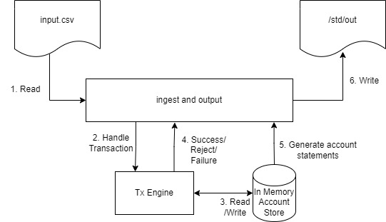

# Payments engine

Simple synchronous single-threaded payments engine.

This toy project takes a CSV file containing a list of clients' transactions,
applies them to client accounts, and outputs client account summaries.

## Usage

`cargo run -- path/to/input.csv`

Build with `cargo build`

Test with `cargo test`

## Design notes

The basic design is shown below. We read inputs from the CSV file, apply them
sequentially to the TxEngine, and the TxEngine applies the business logic,
updating accounts stored in the AccountStore. Once all the inputs are
processed, the AccountStore generates account statements for each account.

### Ingest -> TxEngine: Who calls who?

In this design, we simply iterate through all the input CSV lines and call the
TxEngine for each. I chose this approach instead of the inverse (e.g.
constructing a stream of transactions and having the TxEngine consume the
stream).

The main reasons for this are centered on extensibility, given the likely
requirement to replace file-based CSV input with some network-based ingest. In
which case that ingest would likely need to, amongst other things:
* Send responses back to its clients for rejected or failed transactions.
* Handle and propagate back-pressure from the engine and storage layers to
  prevent overload.
* Handle repeated and out-of-order transactions before passing them to the
  TxEngine.
* Persist incoming transactions to prevent data loss before processing.

Most of which are easier if the Ingest layer can "call" the TxEngine and handle
its responses.

### Storage

* Use in-memory storage.
  - It's fast.
  - The required data (max 64k accounts, max 2^32 transactions) should fit in
  memory on a modern device.
  - We don't require persistence: this is a toy application.
* Don't try to abstract-out the storage mechanism. I briefly thought about
  adding an abstraction to allow use of both in-memory storage and a relational
  database. However, the data model and access semantics are too different to
  make a solid abstraction, and wouldn't justify the effort.

### Data model

* Simple HashMap of client-id -> Account
* Account contains total-funds and actively-disputed funds but _not_ held or
  available funds, which are derived. This allows us to handle cases where
  the total funds refered to in active disputes exceeds the total funds in the
  account.
* Account also contains a HashMap of deposits related to the account.
  - Only deposits, because record of other transactions are not required in this
  simple toy project.
  - Having the deposits within the account record would not be feasible with a
  database, as the deposit list could grow indefinitely. It would need to be
  represented as separate records (i.e. an accounts table and a transactions
  table). This only works in memory as the HashMap is dynamically allocated.

### Modelling disputes

* Disputes can only apply to deposits
* Deposits can have four states as shown below. I chose to differentiate
  between `NotDisputed` and `Resolved` in case that was valuable to query
  transaction state, but it's likely redundant.
* Notably, `Resolved` transactions can be re-disputed.

| State / Action | Dispute  | Resolve  | Chargeback |
|----------------|----------|----------|------------|
| Not Disputed   | Disputed |          |            |
| Disputed       |          | Resolved | Refunded   |
| Resolved       | Disputed |          |            |
| Refunded       |          |          |            |

## Areas for improvement

I ran out of time after a few hours. If I had a bit more time, I would've added:

* Logging/tracing. A must for supportability and maintainability.
* Metrics about quantity and processing time of transactions. Not very
  interesting for single-threaded non-blocking application, but would be
  valuable if we expand to a multi-threaded or concurrent model.
* Outputting information about rejected or failed transactions.
* More thorough testing. Coverge is adequate but I'm sure there are interesting
  sequences of transactions missing. Perhaps some property-based testing would
  be valuable here.
* More ergonomic way to validate `TransactionEngine` behaviour in testing.
  Currently we have test-only methods to query the underlying account store,
  but we could use a mock here instead.
* Multi-threading support to allow faster processing of transactions.

Beyond which, as hinted above, there's a wealth of functional and
non-functional extensions that could take this beyond a basic toy project...
but they deserve a proper conversation.
